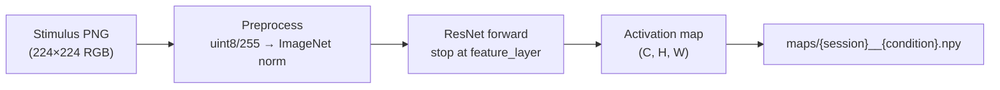
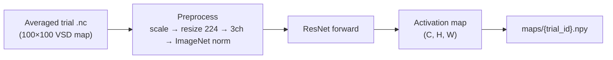

# DL feature extraction (stage 02 / 02b)

Extract spatial activation maps from pretrained CNN backbones.

## Stage 02b — stimulus inputs (encoding pipeline)

CNN features are computed **once per condition** from rendered stimulus PNGs (stage 01b).



### Output layout

```
Data/VSD_Encoder_01/DL_features_stimuli/
└── {monkey}/{model_slug}/{feature_layer}/
    ├── config.json
    ├── manifest.parquet
    └── maps/
        ├── 270618b__condAN1.npy
        └── ...
```

### Run

```bash
PYTHONPATH=. python scripts/02b_extract_stimulus_features.py \
  --config configs/default.yaml \
  --model configs/models/resnet18.yaml
```

Cluster:

```bash
sbatch slurm/extract_stimulus_features.slurm
```

Trial-level training joins these condition maps back via `encoding_pairs` manifest (`date` + `condition`).

---

## Stage 02 — legacy VSD inputs

`02_extract_features.py` reads averaged VSD `.nc` files (not used for encoding).



Output: `Data/VSD_Encoder_01/DL_features/{monkey}/{window_id}/...`

```bash
PYTHONPATH=. python scripts/02_extract_features.py \
  --config configs/default.yaml \
  --window configs/windows/evoked_32_42.yaml \
  --model configs/models/resnet18.yaml
```

---

## Feature layers (ResNet)

| `feature_layer` | After | ResNet18 shape (224 input) | ~size / map |
|-----------------|-------|----------------------------|-------------|
| `layer1` | 1st conv block | (64, 56, 56) | ~800 KB |
| `layer2` | 2nd conv block | (128, 28, 28) | ~400 KB |
| `layer3` | 3rd conv block **(default)** | (256, 14, 14) | ~200 KB |
| `layer4` | 4th conv block | (512, 7, 7) | ~100 KB |
| `avgpool` | global average pool | (512, 1, 1) | ~2 KB |

## Config

`configs/models/resnet18.yaml`:

```yaml
feature_layer: layer3
input_scaling: none          # VSD path only
imagenet_normalize: true
input_size: 224
```

Stimulus path uses RGB `/255` preprocessing (no `input_scaling` option).

See `docs/encoding_pipeline.md`.
