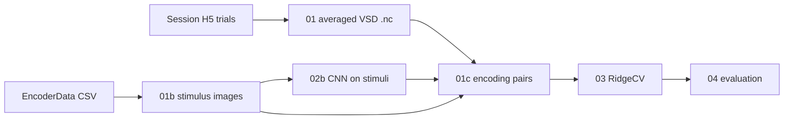

# Encoding pipeline overview

End-to-end goal: predict trial-averaged VSD maps from CNN features of the **presented stimulus image**.



## Stages

| Stage | Script | Output |
|-------|--------|--------|
| 01 | `01_build_averaged_trials.py` | averaged VSD maps (targets **Y**) |
| 01b | `01b_build_stimulus_images.py` | rendered stimulus PNGs |
| 01c | `01c_build_encoding_pairs.py` | trial-level join manifest |
| 02b | `02b_extract_stimulus_features.py` | CNN maps from stimuli |
| 03 | `03_train_ridge_encoder.py` | RidgeCV model + QC plots |
| 04 | `04_evaluate_ridge_encoder.py` | metrics + reconstructions *(planned)* |

## Training unit

**Trial-level encoding** (many trials per condition):

- **X**: CNN features of the stimulus for that trial's `(monkey, date, condition)`
- **Y**: that trial's averaged VSD map
- CNN features are computed once per condition and joined to all trials in that condition

## Data roots

```
Data/
├── EncoderData/                     # stimulus catalogs (CSV)
└── VSD_Encoder_01/
    ├── averaged/                    # VSD targets
    ├── stimuli/                     # rendered stimulus images
    ├── DL_features_stimuli/         # CNN features of stimuli
    ├── encoding_pairs/              # trial join table
    └── ridge_encode/                # models + metrics
```

## Docs

- `docs/stimulus_rendering.md` — stage 01b
- `docs/encoding_pairs.md` — stage 01c
- `docs/ridge_encoding.md` — stage 03
- `docs/cluster_pipeline.md` — cluster setup and SLURM
- `docs/preprocessing.md` — stage 01 (VSD averaging)
- `docs/DL_feature_extraction.md` — CNN feature extraction (being updated for stimulus inputs)
- `docs/DATA_LAYOUT.md` — shared VSD trial data layout
